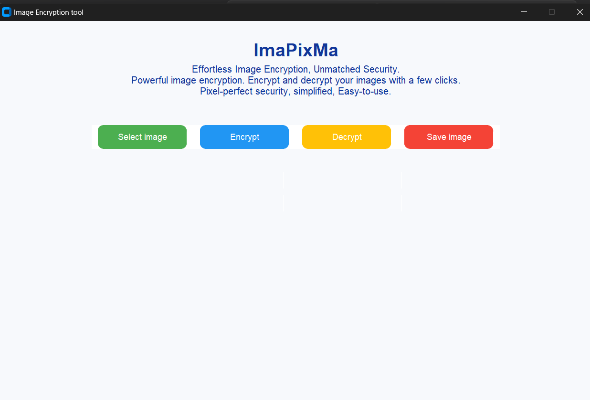
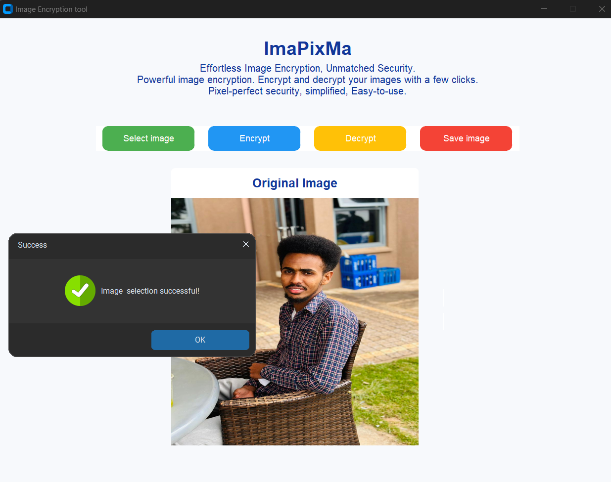
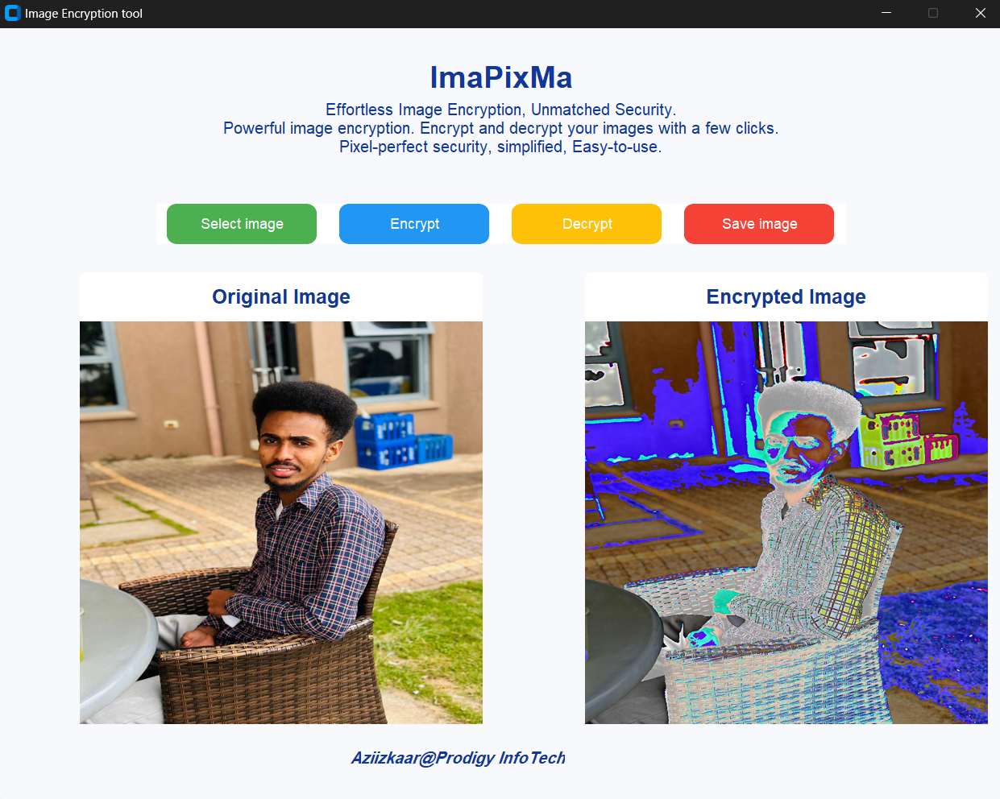
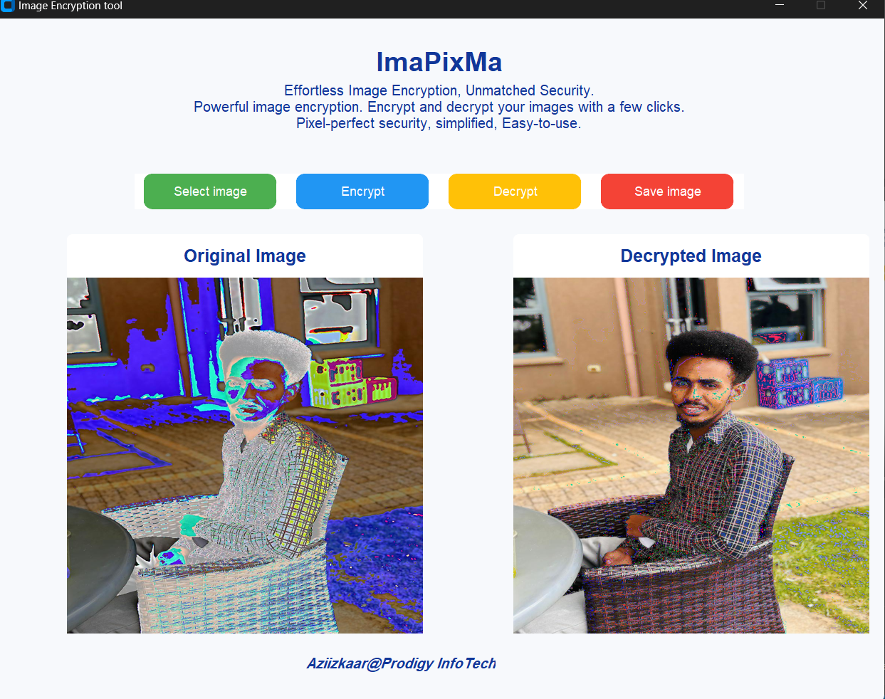

# ImaPixMa

## About the App

ImaPixMa is an interactive, GUI application, simple encryption tool that allows users to encrypt 🔒 and decrypt 🔓 images by pixel manipulation. 🔑
It has non-discriminating features that enable ease of use for technical and non-technical individuals.

### App interface

## Key features

ImaPixMa has the following features:

- Image Upload: Through the “Select Image” button ▶️ , users can select an image from their local machine using a file dialog. Supported image formats include JPG, JPEG, and PNG.

- Image Encryption 🔒 : ImaPixMa encrypts the uploaded image using a simple mathematical operation and displays the Encrypted image for users to see before saving.

- Image Decryption 🔓 : It decrypts the encrypted image back to its original form. The Decrypted image is also displayed.

- Image Saving ⬇️ : The app has the functionality where users can save either the encrypted or decrypted image to their local machine.

- Error handling: ImaPixMa has added functionalities where message boxes pop up on the screen, should the user attempt to do encryption, decryption, or saving without uploading an original image.

## ImaPixMa in use

- Original image:
 We will play around with the image below
 

### Encrypting an image

- Selecting the image to encrypt:

- Encryption by clicking encrypt button:

#### Output
- Saved image:

### Decrypting an image

- Selecting the image to decrypt:

- Decryptiom by clicking decrypt button:

#### Output
- Saved image:

Is the image similar to the original image?

